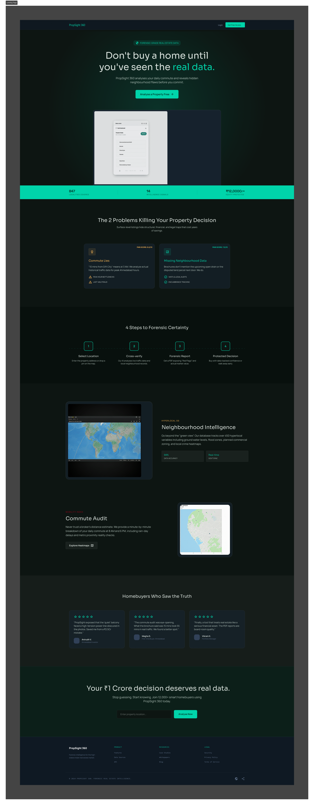
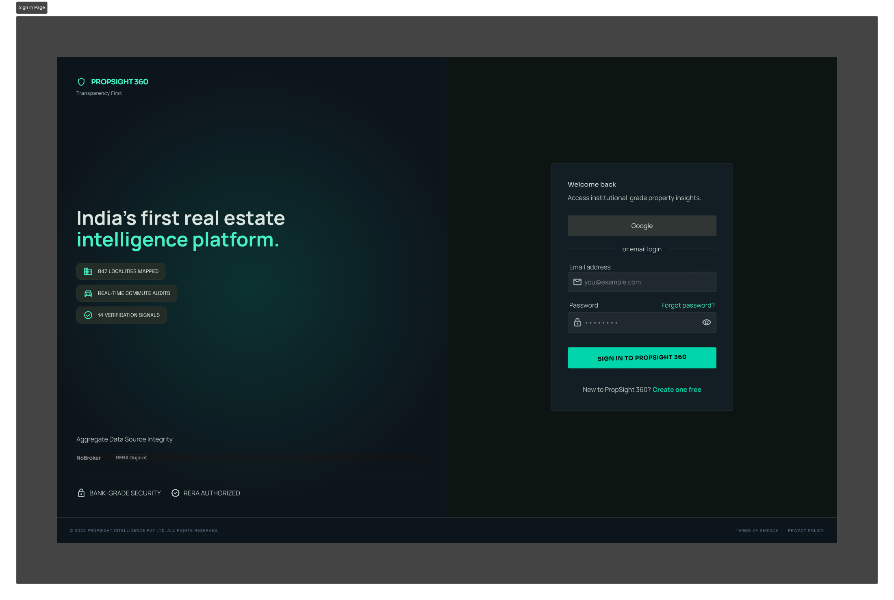
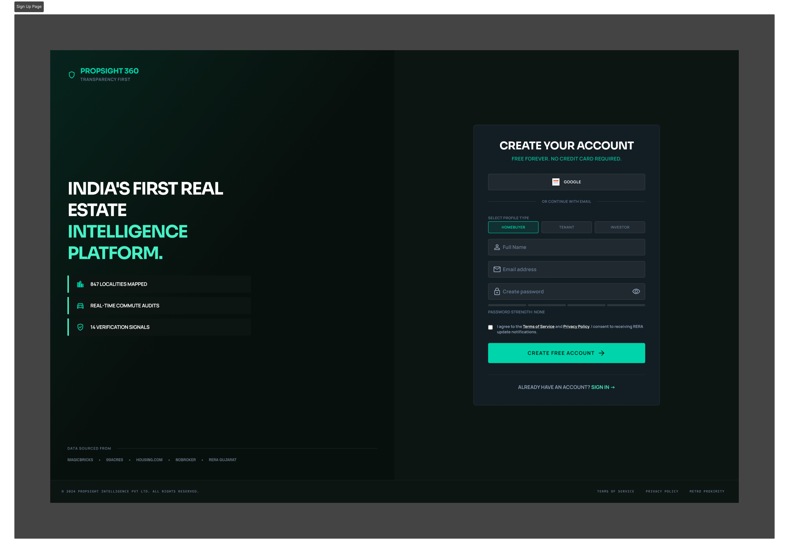
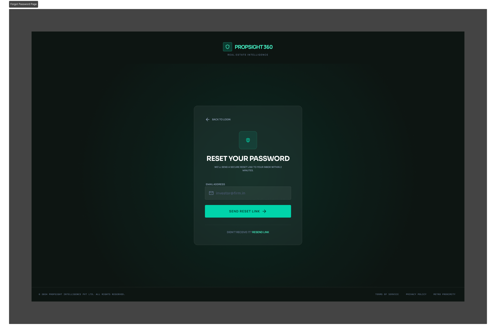
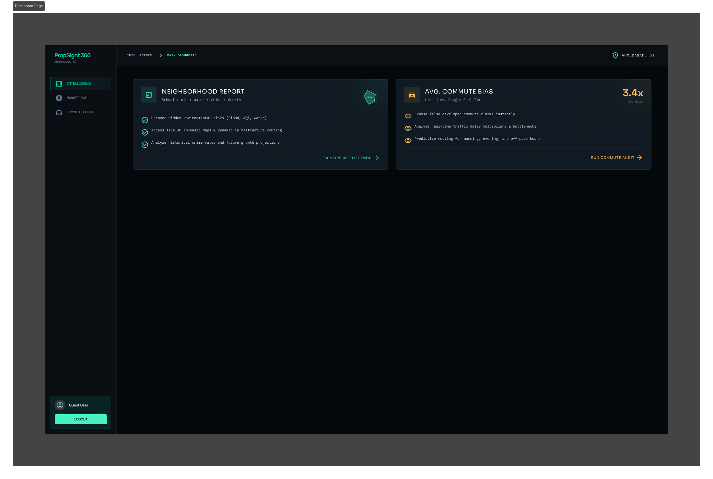
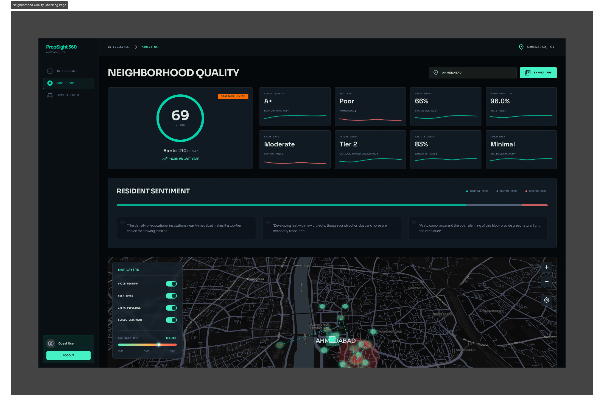
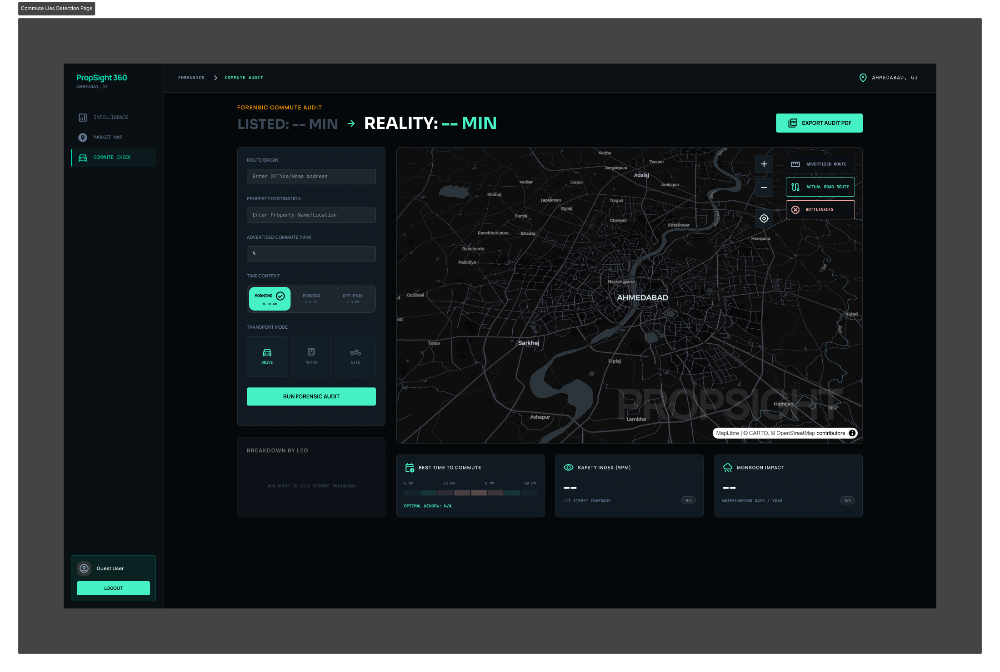

<p align="center">
  
</p>

> **Beyond Listings. Into Insights.**  
> A forensic real estate intelligence platform that exposes misleading commute claims and missing neighbourhood data — built for the Indian homebuyer.

<br/>

<div align="center">

[](https://www.figma.com/design/9shHlHtL2HR5PykqfvkThu/Untitled?node-id=0-1&t=phEgmRXcp0cM3YYp-1)
[](https://propsight360.netlify.app/)
[](https://propsight-360.onrender.com/)
[](https://documenter.getpostman.com/view/50841281/2sBXqKofY4)
[](https://www.youtube.com/watch?v=AGFMCnbXtJ8)

</div>

---

## 🚨 The Problem

India's real estate market — operates with a dangerous lack of transparency. Homebuyers making **multi-crore decisions** face two compounding problems:

### Problem 1 — Misleading Commute Times `[Pain Score: 85.5/100]`
> *"Real estate marketing claims like '5 minutes from metro' are wildly inaccurate because they measure straight-line distances on maps rather than actual peak-hour walking time accounting for traffic signals, crowded sidewalks, and infrastructure obstacles."*

- Developers advertise straight-line map distances, not actual travel time
- Peak-hour reality is 3–4x longer than advertised
- No standardised commute disclosure requirement in India
- Buyers discover the truth only after possession

### Problem 2 — No Standardised Neighbourhood Data `[Pain Score: 94.5/100]`
> *"Home buyers making multi-crore investment decisions lack comprehensive, data-driven information about neighbourhood characteristics like school quality, crime statistics, air quality indices, water availability, power outage frequency, and future infrastructure plans."*

- No single source for locality intelligence in India
- Government data is siloed across multiple portals
- Buyers rely on broker-provided information (conflict of interest)
- NRIs have zero ability to remotely assess property context

---

## 💡 The Solution

**PropSight 360** is a forensic real estate intelligence platform that aggregates, cross-verifies, and presents property data in a transparent, data-driven interface — empowering buyers to make decisions with complete neighbourhood and commute intelligence.

```
When a user opens PropSight 360, they should feel:
"I have POWER. I cannot be fooled.
 I know more than the brokers. I am protected."
```

---

## ✨ Key Features

### 🚗 Forensic Commute Audit
- Listed commute vs **real peak-hour commute** with 3.6x bias detection
- Multi-modal breakdown: Drive, Metro, Bike, Auto/Cab
- Bottleneck identification with street-level imagery
- Hourly traffic heatmap showing best commute windows
- Monsoon waterlogging risk and safety index for route

### 🗺️ Neighbourhood Intelligence
- **847 localities** with live data across Ahmedabad
- 8-dimensional quality scoring: School Quality, AQI, Water Supply, Power Stability, Crime Rate, Future Infrastructure, Vastu & Orientation, Flood Risk
- Resident sentiment analysis with verified quotes
- Interactive heatmaps: Price zones, Risk zones, Infrastructure pipelines, School catchment
- Compare any two localities side-by-side

### 📄 Verified Audit Report
- Shareable PDF report for both intelligence layers
- Designed for sharing with family, CA, or legal advisor

---

## 📱 Product Screens

### 🏠 Landing Page

> *"Don't buy a home until you've seen the real data."* — The public-facing page that introduces PropSight 360's forensic intelligence capabilities.

---

### 🔐 Authentication Flow

| Sign In | Sign Up | Forgot Password |
|---------|---------|-----------------|
|  |  |  |
| Split-panel login with Google SSO and email login | Profile-type selection (Homebuyer / Tenant / Investor) with password strength indicator | Secure reset link delivery within 2 minutes |

---

### 📊 Dashboard — Intelligence Hub

> Unified entry point showing the **Neighbourhood Report** and **Avg. Commute Bias (3.4×)** cards, letting users jump straight into intelligence or commute auditing.

---

### 🗺️ Neighbourhood Quality

> 8-metric locality scorecard (School Quality, AQI, Water Supply, Power Stability, Crime Rate, Future Infra, Vastu & Orient, Flood Risk) with resident sentiment analysis and interactive map layers.

---

### 🚗 Forensic Commute Audit

> Side-by-side **Listed vs Reality** commute comparison with real-time route mapping, bottleneck detection, best commute time windows, safety index, and monsoon impact scoring.

---

## 🛠️ Tech Stack

### Frontend
```
React.js + Vite            — Core framework & dev tooling
Tailwind CSS               — Utility-first styling
React Router               — Client-side routing
Google Material Symbols    — Iconography
Google Fonts (Sora,
  Manrope, Space Grotesk)  — Typography
```

### Backend
```
Node.js + Express          — API server
MongoDB Atlas              — User & property database
JWT + HTTP-Only Cookies    — Secure session management
Google OAuth 2.0           — Social authentication
bcryptjs                   — Password hashing
```

### Data Sources
```
TomTom API                 — Real-time commute data
AQICN API                  — Air Quality Index
OpenWeather API            — Environmental data
```

### Infrastructure
```
Vite Dev Server            — Local development
Netlify                    — Production deployment
```

---

## 📁 Folder Structure
```
PropSight_360/
│
├── 📂 Backend/
│   ├── 📂 config/
│   ├── 📂 controllers/
│   ├── 📂 middleware/
│   ├── 📂 models/
│   ├── 📂 routes/
│   ├── 📂 services/
│   ├── 📂 utils/
│   ├── .env.example
│   ├── .gitignore
│   ├── package.json
│   └── server.js
│
└── 📂 Frontend/
    ├── 📂 public/
    │   └── 📂 screenshots/
    ├── 📂 src/
    │   ├── 📂 api/
    │   ├── 📂 assets/
    │   ├── 📂 components/
    │   │   ├── 📂 AuditReport/
    │   │   ├── 📂 Auth/
    │   │   ├── 📂 Commute/
    │   │   ├── 📂 Dashboard/
    │   │   ├── 📂 Landing/
    │   │   ├── 📂 Neighborhood/
    │   │   ├── 📂 Onboarding/
    │   │   └── 📂 common/
    │   ├── 📂 features/
    │   ├── 📂 hooks/
    │   ├── 📂 pages/
    │   ├── 📂 store/
    │   ├── 📂 utils/
    │   ├── App.jsx
    │   ├── index.css
    │   └── main.jsx
    │
    ├── .env.production
    ├── .gitignore
    ├── eslint.config.js
    ├── index.html
    ├── package.json
    ├── README.md
    └── vite.config.js
```
---

<div align="center">

**PropSight 360** — Built with ❤️ for India's homebuyers

*"The best investment you can make is in the truth about your investment."*

</div>
